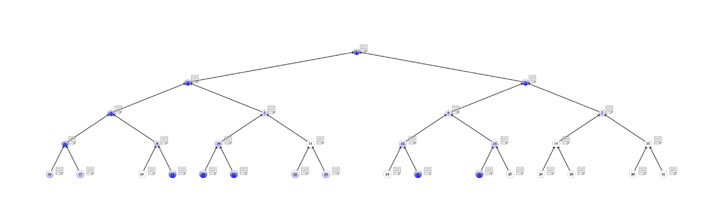

# Character tree

An PDF tree generator representing a genetic character in a family (like in a genealogic tree) from a formatted
CSV file.

## Requirements

LaTeX have to be install on the targeted system with the pagth to PDFLaTeX as an environment variables.

The CSV file has the following format: `id;name;character`
For the time being, nothing is configurable.

## Run

In a terminal, run the command `make` or `make all` and the compiled PDF will be created in the current directory, named `tree.pdf`.

---

© 2021 Bruno VERCHÈRE